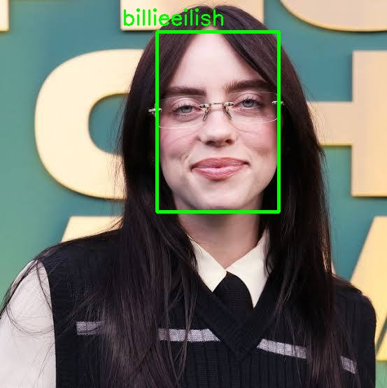

# **Face Recognition System**


A comprehensive **Face Recognition System** using **InsightFace** for:
- **Face Verification** (Confirm if two images belong to the same person)
- **Face Identification** (Recognize individuals from a stored database)
- **Face ID** (Use facial recognition as a password for applications)
---
## 🚀 Features

### ✅ **Face Verification**
- Install **InsightFace** package.
- Create `face_verification.py` file.
- Get two image paths using command-line arguments:
  ```sh
  python face_verification.py --image1 ./img1.jpg --image2 ./img2.jpg
  ```
- Extract **512D embedding vectors** for images using InsightFace.
- Compare **embedding vectors**.
- Print:
   - `Same Person` if embeddings are similar.
   - `Different Persons` otherwise.

---

### ✅ **Face Identification**
- Create `create_face_bank.py` file.
- Extract **512D embedding vectors** for known persons using InsightFace.
- Save **face embeddings** to `face_bank.npy`.
- Create `face_identification.py` file.
- Get an image path using command-line arguments:

  ```bash
  python face_identification.py --image ./img.jpg
  ```
- Recognize and print the **name** of the person in the image.
- Draw a **bounding box** and **name** on the recognized face.
- Add `--update` argument to `face_identification.py`:

  ```bash
  python face_identification.py --image ./img.jpg --update
  ```
  - If `--update` is used, **the face bank** updates automatically before identification.

---

### ✅ **Face ID (Smart Webcam-Based Password)**
- Use **FaceIdentification module** to create a **smart webcam-based password**.
- Utilize face authentication for secure access to applications.
- Face recognition as a **keyless login mechanism**.
---

## 📌 Result

- Input images:


- Output of identification system:




## How to Run the Code
1. Clone the repository:

   ```
   https://github.com/nakhani/Face_Recognition_System.git
   ```

2. Navigate to the directory:

   ```
   Face_Recognition
   ```

3. Install the required packages:
   ```sh
   pip install -r requirements.txt
   ```

4. Run the project:
   ```bash
    python create_face_bank.py #For creating 512D embedding vector 
    python face_identification.py #For identifying person in each image
    python Face_auth.py # For authorizing a person's face to log in
    python Face_verification.py #For verifying 2 persons
   ```

    ```bash
    jupyter notebook create_face_bank.ipynb #For creating 512D embedding vector 
    jupyter notebook face_identification.ipynb #For identifying person in each image
    jupyter notebook Face_Verification.ipynb #For verifying 2 persons
   ```
---
## Dependencies
- Python 3.x
- OpenCv
- NumPy
- Insightface

